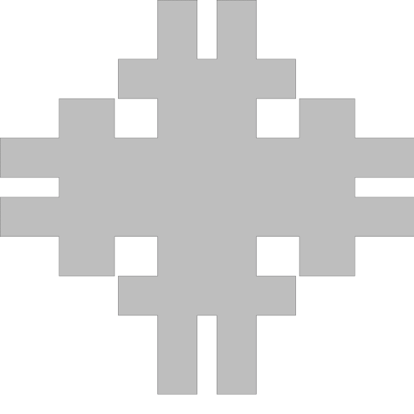

# Illustrated Baseline for CG:SHOP 2023 - Convex Covers

<p align="center">
  
</p>

This repository contains code that provides and illustrates a baseline solution for the 
[CG:SHOP 2023](https://cgshop.ibr.cs.tu-bs.de/competition/cg-shop-2023) competition, which 
involves computing small convex covers of arbitrary polygons with holes. This is also my final project for the
CS263 Computational Geometry course at Tufts. 

- [Approach](#approach)
- [Installation and Usage](#installation-and-usage)
- [References](#references)

## Approach

The first step in computing a cover is triangulation. The teams that won CG:SHOP competition used constrained 
Delaunay triangulation but I decided to perform ear-clipping, since it turned out to be much easier to implement.
Even so, ear-clipping requires the polygon to be simple, and the competition allows instances to have holes. To remedy
this, I connect each hole to the boundary of the polygon with a pair of edges between pairs of duplicate vertices. This
then allows me to perform triangulation.

Once the polygon is triangulated, I perform an operation described by the authors of the competition in reference to
their benchmark solution: I randomly select pairs of convex pieces in my cover and check if their convex hull is
contained with the target polygon. If it is, I decrease the size of cover by one and continue the process. If I fail to
find a new pair after 10000 attempts (this number is configurable via command-line), I terminate the process and return
the current cover. 

All the geometric operations in the project are written by me, with the exception of Graham Scam, which I largely 
borrowed from [here](https://www.geeksforgeeks.org/convex-hull-using-graham-scan/) (with some modifications).
The most difficult tasks overall was to make triangulation work on all sorts of edge cases.

This repository also hosts the [slides](Presentation.pdf) I made in April 2023 on the Minimal Cover Problem as part of CS263.

## Installation and Usage

The only requirement to run the code is to have `java` and `javac` installed on your machine.
To automatically compile and bundle the sources into `Cover.jar` archive, run:

```bash
make
```

To execute the program, run 

```bash
java -jar Cover.jar -file=PROBLEM.json
```

where `PROBLEM.json` is an input file that follows the format of problem instances from the CG:SHOP 2023 competition, 
as described [here](https://cgshop.ibr.cs.tu-bs.de/competition/cg-shop-2023/#instance-format). 
The [instances](instances) directory of this repository contains several example problems from the
competition, for example you can run the following command to generate images that form the .gif animation above 
(and follow the algorithm for reducing the size of a convex cover):

```bash
java -jar Cover.jar -file=instances/socg60.instance.json --gif
```

To get a full list of available options, run `java -jar Cover.jar -h`.

## References

Fekete, S. P., Keldenich, P., Krupke, D., & Schirra, S. (2023). [Minimum Coverage by Convex Polygons: The CG: SHOP Challenge 2023.](https://arxiv.org/pdf/2303.07007.pdf)